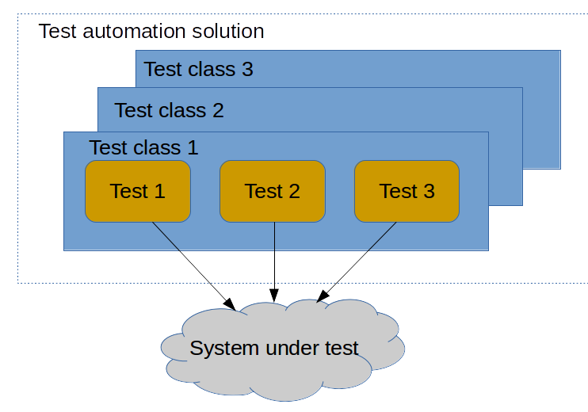

##  Test automation framework architecture: No architecture

Most of the "UI test automation" tutorials I have seen describe the Test Automation Solution where Selenium Web Driver is used directly from test methods and no additional abstraction layer exists. This "architectural pattern" is so ubiquities, that I decided to describe this as well.

I think, we can call this "architectural pattern" as **No architecture**. The structure of test automation solution created with **No architecture** pattern presented (in a very rough way) on the picture below:

Such test automation solution usually consists of some amount of test classes, each containing some number of test methods. All orchestration of interaction with System Under Test (SUT) is done either (using JUnit terms) in *setUp* and *tearDown* methods, or test methods themselves. Tool, whatever it is - Selenium, RestAssured, Selenide - called directly in test methods.

Such approach is industry well known anti-pattern. However, in some cases, it may be ok to use. There're some benefits: 
  * As no abstraction layers exists such tests are fairly easy (and fast) to create
  * As all code exists in one place it is fairly easy to understand what is going on

Those benefits has their price though:

  * Should you consider moving from one tool (lets say Selenium) to the other (lets say Selenide) you will have to update all tests you have
  * Should your UI (Web API) change slightly (id update, url update), all tests touching this UI (Web API) should be updated
  * Tests are not communicating well what they are testing, but very verbose on details how they test
  * Most likely there going to be lots of code duplications between test methods

If your plan is to add simple sanity check for a stable legacy system (and you are not going to have more than, lets say, 30 test cases), this may be a reasonable way to go.